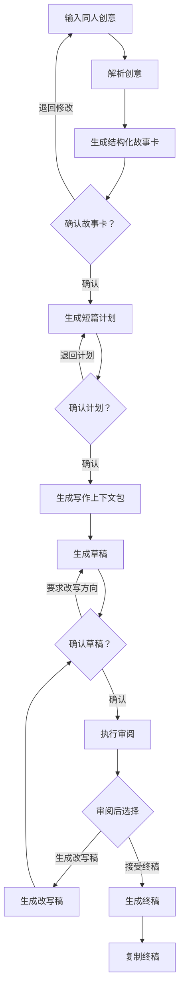
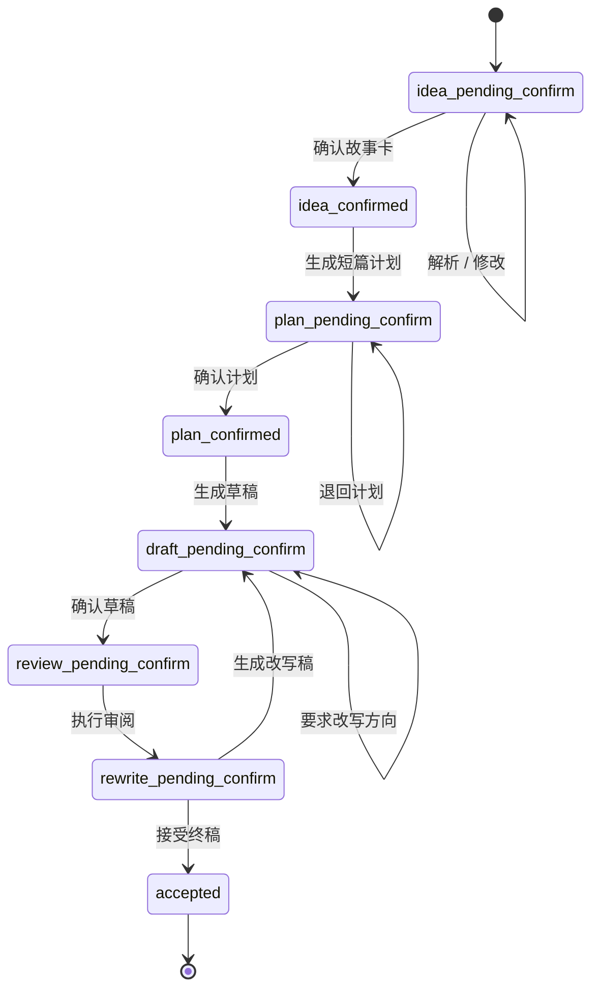
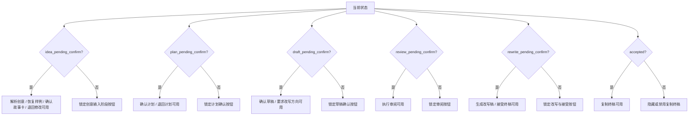
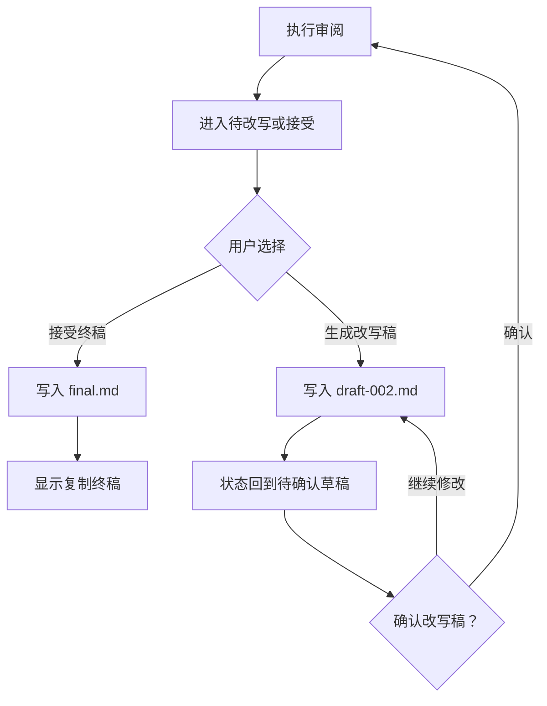
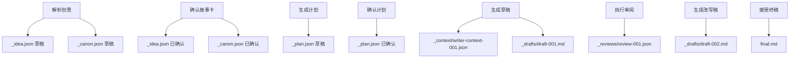

# 同人短篇 UI 交互流程图 / Fanfic UI Interaction Flow

> 创建时间 / Created: 2026-06-19  
> 状态 / Status: COMPLETED / 已完成  
> 对应阶段 / Phase: Phase 0 UI Design Draft  
> 对应设计稿 / Mock: `docs/fanfic-idea-workspace.html`

## 1. 目的 / Purpose

本文档沉淀 Phase 0 静态 HTML 设计稿中的 UI 交互流程，用于后续 Phase 1 状态机、artifact 落盘和端到端测试设计。

This document records the UI interaction flow from the Phase 0 static HTML mock. It should be used as the reference for Phase 1 state machine implementation, artifact persistence, and end-to-end workflow tests.

核心原则：

- 每个关键步骤都需要人工确认。
- 已通过的前置步骤按钮应锁定，避免重复执行旧状态。
- 生成改写稿后必须回到“待确认草稿”，不能直接跳到终稿。
- 终稿只有人工接受后才可复制。

Core principles:

- Every key step requires human confirmation.
- Previous-step buttons are locked after approval.
- Rewrite returns to draft confirmation instead of jumping to final.
- Final text can be copied only after human acceptance.

## 2. 主流程 / Main Flow

## 3. 状态机 / State Machine

状态说明：

| 状态 | UI 显示 | 可执行主动作 |
| --- | --- | --- |
| `idea_pending_confirm` | 当前：待确认故事卡 | 解析创意、确认故事卡、退回修改 |
| `idea_confirmed` | 当前：故事卡已确认 | 生成短篇计划 |
| `plan_pending_confirm` | 当前：待确认短篇计划 | 确认计划、退回计划 |
| `plan_confirmed` | 当前：计划已确认 | 生成草稿 |
| `draft_pending_confirm` | 当前：待确认草稿 | 确认草稿、要求改写方向 |
| `review_pending_confirm` | 当前：待执行审阅 | 执行审阅 |
| `rewrite_pending_confirm` | 当前：待改写或接受 | 生成改写稿、接受终稿 |
| `accepted` | 当前：终稿已接受 | 复制终稿 |

## 4. 按钮可用性 / Button Availability

实现约束：

- UI 按钮禁用只是第一层保护。
- 每个 action handler 内部也必须检查当前状态，避免通过脚本或异常点击重复执行旧步骤。
- 后续真实实现中，状态转移应由工程代码控制，LLM 只生成内容，不决定状态。

Implementation constraints:

- Disabled buttons are only the first protection layer.
- Each action handler must also validate the current state.
- In the real implementation, engineering code owns state transitions. The LLM generates content only.

## 5. 改写循环 / Rewrite Loop

关键点：

- 改写稿不是自动终稿。
- 改写后必须重新确认草稿。
- 重新确认后必须重新审阅。
- 只有审阅后的版本才能被接受为终稿。

## 6. Artifact 流程 / Artifact Flow

当前 mock 中产物路径：

| 产物 | 路径 |
| --- | --- |
| 创意 JSON | `fanfics/rain-letter/_idea.json` |
| Canon JSON | `fanfics/rain-letter/_canon.json` |
| 短篇计划 | `fanfics/rain-letter/_plan.json` |
| 写作上下文包 | `fanfics/rain-letter/_context/writer-context-001.json` |
| 初稿 | `fanfics/rain-letter/_drafts/draft-001.md` |
| 审阅 | `fanfics/rain-letter/_reviews/review-001.json` |
| 改写稿 | `fanfics/rain-letter/_drafts/draft-002.md` |
| 终稿 | `fanfics/rain-letter/final.md` |

## 7. Phase 1 实现状态 / Phase 1 Implementation Status

状态 / Status: COMPLETED / 已完成

Phase 1 已落地为独立 CLI 和可测试状态机，暂不接入 `src/main.ts`。

Phase 1 is implemented as a standalone CLI and tested state machine. It is not wired into `src/main.ts` yet.

CLI commands:

- `npm run fanfic -- init <story_id>`
- `npm run fanfic -- status <story_id>`
- `npm run fanfic -- next <story_id>`
- `npm run fanfic -- run <story_id> <command>`

目前 artifact 内容是 mock，用于验证工程闭环；Phase 2 再替换为 LLM 解析/生成结果。

Artifacts are mock content for now so the engineering loop can be verified. Phase 2 will replace them with LLM parsing and generation results.

## 8. Phase 2 实现状态 / Phase 2 Implementation Status

状态 / Status: COMPLETED / 已完成

Phase 2 已将 `parse_idea` 从 mock artifact 替换为真实 LLM 创意解析。工程代码仍然负责状态转移、路径和人工确认 gate；LLM 只返回结构化内容。

Phase 2 replaces the `parse_idea` mock artifact with real LLM idea parsing. Engineering code still owns state transitions, paths, and human gates; the LLM only returns structured content.

CLI input:

- `npm run fanfic -- run <story_id> parse_idea --idea-file <path>`
- `npm run fanfic -- run <story_id> parse_idea --idea "短同人创意"`

Artifacts:

- `_idea.json`: structured fanfic story card.
- `_canon.json`: canon constraints, character notes, timeline notes, and risk list.

After successful parsing, `next` must return `approve_idea`; plan generation remains locked until the story card is confirmed.

解析成功后，`next` 必须返回 `approve_idea`；在故事卡确认前，短篇计划生成仍然锁定。

## 9. Phase 3 实现状态 / Phase 3 Implementation Status

状态 / Status: COMPLETED / 已完成

Phase 3 已将 `generate_plan` 从 mock artifact 替换为真实 LLM 短篇规划。状态机仍控制 `idea_confirmed -> plan_pending_confirm -> plan_confirmed`，LLM 只生成 `_plan.json` 内容。

Phase 3 replaces the `generate_plan` mock artifact with real LLM one-shot planning. The state machine still owns `idea_confirmed -> plan_pending_confirm -> plan_confirmed`; the LLM only generates `_plan.json` content.

Plan shape:

- 4-5 scenes.
- 2-3 beats per scene.
- Word budget per scene.
- Required scene coverage.
- Avoid checks for dislikes / forbidden elements.
- Ending strategy and writer notes.

成功生成计划后，`next` 必须返回 `approve_plan`；确认计划前不能生成草稿。

After plan generation, `next` must return `approve_plan`; draft generation remains locked until the plan is confirmed.

## 10. Phase 4 实现状态 / Phase 4 Implementation Status

状态 / Status: COMPLETED / 已完成

Phase 4 已将 `generate_draft` 从 mock artifact 替换为真实 writer context pack 和 LLM 初稿生成。状态机仍控制 `plan_confirmed -> draft_pending_confirm -> review_pending_confirm`，LLM 只生成草稿正文。

Phase 4 replaces the `generate_draft` mock artifact with a real writer context pack and LLM first-draft generation. The state machine still owns `plan_confirmed -> draft_pending_confirm -> review_pending_confirm`; the LLM only generates draft prose.

Artifacts:

- `_context/writer-context-001.json`: confirmed idea, canon, plan, required scenes, avoid checks, and writer instructions.
- `_drafts/draft-001.md`: first Markdown draft.

Contract validation:

- Non-empty Markdown.
- Required scene signals present.
- At least 60% of target word count.
- Obvious avoid-list phrases screened.

成功生成草稿后，`next` 必须返回 `approve_draft`；确认草稿前不能进入审阅。

After draft generation, `next` must return `approve_draft`; review remains locked until the draft is confirmed.

## 11. Phase 5 实现状态 / Phase 5 Implementation Status

状态 / Status: COMPLETED / 已完成

Phase 5 已将审阅、改写和接受终稿接入真实 CLI workflow。UI 中的按钮仍只代表人工 gate；每次点击会触发一个受状态机约束的 action，并读取对应 artifact。

Phase 5 connects review, rewrite, and final acceptance to the real CLI workflow. UI buttons still represent human gates only; each click triggers one state-machine-governed action and then reads the matching artifact.

Artifacts:

- `run_review` writes `_reviews/review-001.json`.
- `generate_rewrite` writes `_drafts/draft-002.md`.
- `accept_final` writes `final.md`.

Gate behavior:

- `run_review` is available only after `approve_draft`.
- `generate_rewrite` moves the flow back to `draft_pending_confirm`; the rewritten draft must be confirmed again.
- `accept_final` is available only after review and creates the copyable final output.
- Earlier-step actions remain locked after their gate has passed.

前端现在可以开始和 CLI/local adapter 做半真实联调；后续再把同一组 command 包成 HTTP/API。

Frontend integration can now start against a CLI/local adapter. Later, the same commands can be wrapped as HTTP/API endpoints.

## 12. Local UI 联调状态 / Local UI Integration Status

状态 / Status: COMPLETED / 已完成

静态 HTML 已接入本地 fanfic workflow adapter。`npm run preview:fanfic-ui` 现在同时提供页面和 API：

The static HTML now connects to a local fanfic workflow adapter. `npm run preview:fanfic-ui` serves both the page and API:

- `POST /api/fanfic/session`: 初始化或读取 UI session。
- `POST /api/fanfic/action`: 执行 `parse_idea`、`approve_idea`、`generate_plan`、`approve_plan`、`generate_draft`、`approve_draft`、`run_review`、`generate_rewrite`、`accept_final`。
- `POST /api/fanfic/story-card`: 在故事卡确认前执行单点修订，写回 `_idea.json` 或 `_canon.json`，不重新调用 LLM。
- API 复用 `runFanficCommand`，状态转移和 artifact 落盘仍由工程代码控制，LLM 只负责内容生成。
- UI 从 `_state.json` 和 artifact snapshot 渲染按钮锁定、故事卡、计划、草稿、审阅、改写稿和终稿。
- 本地默认写入 `fanfics-ui-local/`，可用 `FANFIC_ROOT` 覆盖。

验收 / Verification:

- `tests/fanfic-local-adapter.test.ts` 覆盖 adapter snapshot 与完整 action 链路。
- `tests/fanfic-local-http-server.test.ts` 覆盖页面服务、API action 和故事卡单点 patch。
- `tests/fanfic-ui-html.test.ts` 覆盖退回修改、loading 反馈和故事卡单点弹窗修改。
- HTTP smoke 已验证 `session -> parse_idea` 可通过真实模型链路生成 `_idea.json` 与 `_canon.json`。

## 13. Phase 1 测试依据 / Phase 1 Test Reference

Phase 1 状态机实现时，建议按本图生成以下测试：

- 初始状态只允许解析创意。
- 未确认故事卡时不能生成计划。
- 确认故事卡后，创意解析相关按钮和命令应锁定。
- 未确认计划时不能生成草稿。
- 未确认草稿时不能执行审阅。
- 生成改写稿后必须回到 `draft_pending_confirm`。
- 接受终稿后只能复制终稿，不能继续改写或接受。

When implementing Phase 1, use this flow to derive state transition tests and UI/action availability tests.
