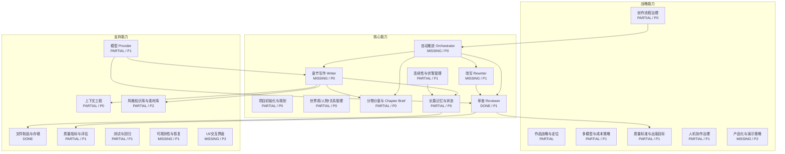

# 用 GitDiagram 生成 Novel Agent 业务能力模块图

> 目标：借助 GitDiagram 快速生成当前 Novel Agent 的业务能力模块图，而不是普通代码目录架构图。

## 1. 直接打开 GitDiagram

当前仓库 remote 指向：

```text
git@github-novel-agent:davidlbsh/novel-agent.git
```

对应 GitHub URL 通常是：

```text
https://github.com/davidlbsh/novel-agent
```

GitDiagram 访问方式：

```text
https://gitdiagram.com/davidlbsh/novel-agent
```

如果仓库是 private：

1. 打开 `https://gitdiagram.com/`
2. 点击 `Private Repos`
3. 提供有 `repo` scope 的 GitHub Personal Access Token
4. 输入 `https://github.com/davidlbsh/novel-agent`

## 2. 为什么需要自定义指令

GitDiagram 默认更擅长生成“代码架构图”：例如 CLI、agents、providers、tests、docs 之间的关系。

但我们现在要的是“业务能力模块图”，应优先参考：

- `docs/NOVEL_AGENT_CAPABILITY_MAP.md`
- `docs/NOVEL_AGENT_ACTION_PLAN.md`
- `README.md`
- `ARCHITECTURE.md`
- `PRODUCTION_AGENT_MAP.md`
- `src/main.ts`
- `src/agents/*`
- `src/novel-state.ts`
- `src/context-profiler.ts`
- `src/chapter-brief.ts`
- `src/quality-metrics.ts`

因此生成时要明确告诉 GitDiagram：不要只画文件目录，要把代码能力抽象成业务能力。

## 3. 可直接粘贴的 GitDiagram 自定义指令

把下面这段粘贴到 GitDiagram 的 custom instructions / regenerate prompt 中：

```text
Generate a business capability module diagram for this repository, not a low-level code folder architecture diagram.

The project is Novel Agent: an Agent system for long-form novel writing. The output should be a Mermaid diagram that groups capabilities into three level-1 capability bands:

1. Strategic Capabilities
2. Core Capabilities
3. Supporting Capabilities

Use the repository files and especially these docs if available:
- docs/NOVEL_AGENT_CAPABILITY_MAP.md
- docs/NOVEL_AGENT_ACTION_PLAN.md
- ARCHITECTURE.md
- PRODUCTION_AGENT_MAP.md
- README.md

For each capability node, include maturity status:
- DONE: implemented and demonstrable
- PARTIAL: partially implemented or not fully connected
- MISSING: not implemented
- DESIGN: only described in older design docs

Use these level-1 and level-2 capabilities:

Strategic Capabilities:
- Work Strategy and Positioning: genre, target length, style target
- Workflow Governance: phase definitions, state transitions, continue strategy
- Multi-model and Cost Strategy: model routing, context budget, upgrade model strategy
- Quality Strategy: quality rubric, quality gates, publishing-level scoring
- HITL Governance: human confirmation, low-score pause, accept gate
- Productization and Demo Strategy: demo path, UI/dashboard roadmap

Core Capabilities:
- Project Initialization and Planning
- World / Character / Relationship Management
- Volume / Chapter Planning and Chapter Brief
- Writer Agent
- Reviewer Agent
- Rewriter Agent
- Long-form Memory and State
- Continuity / Foreshadowing Management
- Orchestrator / Continue Workflow

Supporting Capabilities:
- File Artifacts and Storage
- Context Engineering
- Model Providers
- Quality Metrics and Evaluation
- Style Knowledge Base and Corpus
- Tests and Regression
- Observability and Recovery
- UI / Interaction Layer

Represent dependencies:
- Orchestrator depends on State Machine and Context Packs.
- Writer depends on Chapter Brief, Memory, Style Guide, and Writer Context Pack.
- Reviewer depends on Metrics, Rubric, Style Guide, and Chapter Content.
- Rewriter depends on Review Artifacts and Quality Gate.
- Long-form Memory depends on story_so_far, foreshadowing, character state, timeline, facts.

Use Mermaid flowchart syntax. Make the diagram readable and business-facing. Prefer capability names over file names, but include file references in small labels where useful.

If possible, use visual grouping:
- Strategic Capabilities at the top
- Core Capabilities in the middle
- Supporting Capabilities at the bottom

Add a short legend for DONE / PARTIAL / MISSING / DESIGN.
```

## 4. 推荐的 Mermaid 输出方向

如果 GitDiagram 支持 Mermaid 编辑，可以让最终图接近下面这种结构：



## 5. 生成后如何验收

生成出来的图应该满足：

- 不是单纯 `src/main.ts -> agents -> providers` 的代码依赖图。
- 必须有三层一级能力：战略能力、核心能力、支持能力。
- 必须标注 DONE / PARTIAL / MISSING / DESIGN。
- 必须体现当前 Novel Agent 的最大缺口：`Writer Agent`、`Rewriter Agent`、`Continue Orchestrator`、`State Machine`、`Writer Context Pack`。
- 必须体现当前已完成能力：`Metrics`、`Context Profiler`、`Reviewer`、`Researcher Analyze`、`Coherence Audit`、`Model Routing`、`NovelState`、`Style Guide`。

## 6. 后续可优化

如果 GitDiagram 输出仍然偏代码结构，可以先把 `docs/NOVEL_AGENT_CAPABILITY_MAP.md` 的核心内容同步到 README 的“当前能力地图”章节。因为 GitDiagram 会优先利用 README 和文件树，README 越贴近真实能力，生成结果越稳。
