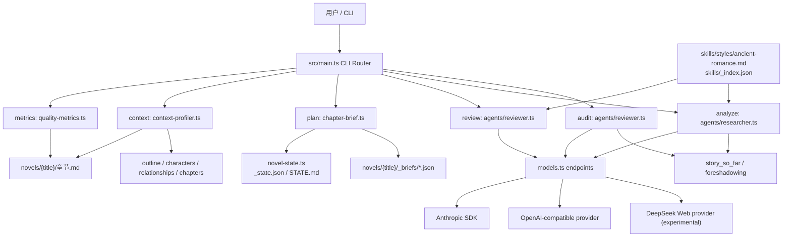
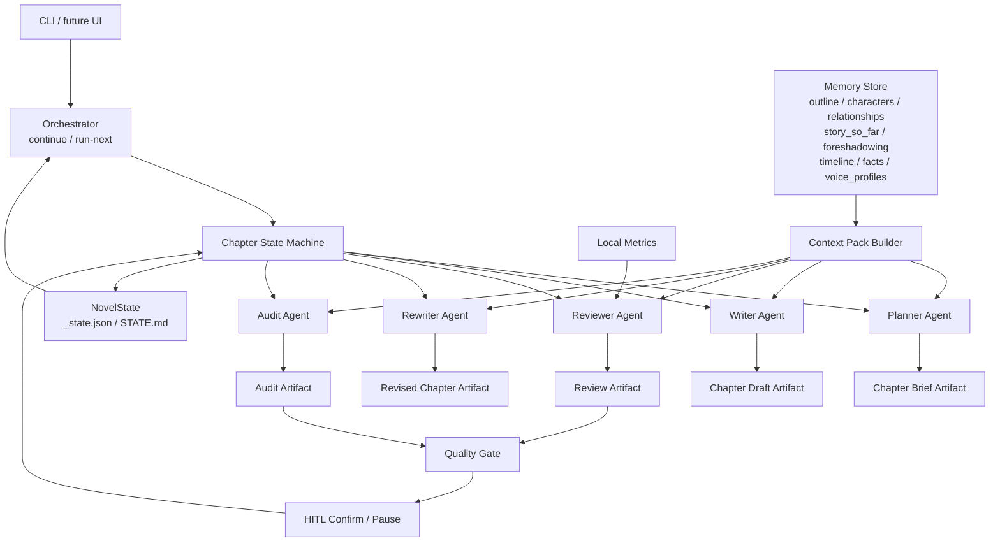

# Novel Agent 项目盘点与行动规划

> 盘点日期：2026-06-17  
> 结论先行：当前项目是一个“长篇小说工程化辅助工具集”，已经有状态文件、章节 brief、质量指标、LLM 审阅、全文分析、连贯性审计和多模型路由雏形；但还不是完整的自动化长篇小说 Orchestrator Agent。最关键的缺口是：没有自动写作主链路、没有 Writer/Rewriter Agent、没有状态机驱动的 `continue` 流程，也没有把人物、伏笔、风格、摘要、评分闭环稳定接入每章生成。

## 1. 项目现状总结

### 1.1 当前真实能力

当前 `package.json` 暴露的可运行命令是：

| 命令 | 当前能力 | 状态 |
| --- | --- | --- |
| `npm run metrics <小说名> [章节号]` | 对已有章节做纯文本质量指标分析，包括对话占比、句长、重复短语、感叹号、副词、禁忌词、直白心理描写等 | 已实现，可演示 |
| `npm run review <小说名> <章节号>` | 调用 LLM 对单章打分，输出 6 维评分、反馈、weak spots，并注入本地质量异常 | 已实现，需要 API |
| `npm run context <小说名>` | 估算 review/analyze/audit 的上下文规模和 input tokens 风险 | 已实现，可演示 |
| `npm run plan <小说名> <章节号>` | 根据 `_chapters.json`、`_story_so_far.md`、上一章摘录生成 `_briefs/{章节}.json`，并更新章节状态为 `planned` | 已实现，但 Planner 是规则版，不是 LLM |
| `npm run analyze <小说名>` | 读取已有章节、规划和设定，调用 LLM 重建 `_story_so_far.md`、`_foreshadowing.json`、断点分析 | 已实现，需要 API |
| `npm run audit <小说名>` | 读取所有已写章节和伏笔记录，调用 LLM 做跨章连贯性审计 | 已实现，需要 API |
| `npm test` | Vitest 单测 | 有测试文件，但当前环境缺少本地 `vitest`，命令无法运行 |

当前可演示的内容：

- 对 `novels/烟雨长安` 或 `novels/偏偏是你2` 运行 `metrics/context/plan`，展示不依赖 API 的工程能力。
- 对配置好 API 的环境运行 `review/analyze/audit`，展示 LLM 审阅和分析能力。
- 展示 `skills/styles/ancient-romance.md`、`skills/_index.json` 作为风格知识库和范例库。
- 展示 `novels/*/_chapters.json`、`_story_so_far.md`、`_foreshadowing.json`、`_briefs/*.json`、`_state.json` 作为长篇写作制品。

### 1.2 只是设计或旧文档宣称、但当前未落地的能力

这些能力出现在 README、`PROGRESS.md`、`小说生成系统设计文档.md`、`技术实现方案.md` 或 `PRODUCTION_AGENT_MAP.md` 中，但当前 `src/` 没有对应实现，不能视为已支持：

- `npm start <小说名>` 自动创建小说、生成大纲、人物、关系、章节列表。
- `continue` 自动判断下一步并推进 `pending -> planned -> drafted -> reviewed -> revised -> accepted`。
- Writer Agent 自动写完整章节。
- Rewriter Agent 根据 review 反馈自动改写。
- Lead Agent / Plot Agent / Writer Agent / Editor Agent / QA Agent 多 Agent 团队。
- Agent Loop 基础框架、Tool Registry、文件工具、任务队列、Worker Threads。
- SQLite 状态管理、JSONL 队列、后台任务系统。
- UI 进度条、可视化界面、Web 交互。
- 上下文自动压缩模块 `context-compact.ts`、持久化 Todo 模块 `todo.ts`、`novel-agent.ts` 等旧文档提到的文件。

### 1.3 当前目录和模块事实

核心代码：

- `src/main.ts`：CLI router，分发 `metrics/review/context/plan/analyze/audit`。
- `src/quality-metrics.ts`：纯文本质量指标。
- `src/context-profiler.ts`：任务级上下文规模预检。
- `src/chapter-brief.ts`：规则版 Chapter Brief 生成和保存。
- `src/novel-state.ts`：`_state.json` 和 `STATE.md` 状态管理。
- `src/xml-plan.ts`：XML 章节计划结构和 LLM 计划生成函数，但当前主 CLI 未接入写作链路。
- `src/models.ts`：多模型角色路由。
- `src/providers/openai-compatible.ts`：OpenAI-compatible 到 Anthropic message 接口的适配器。
- `src/providers/deepseek-web.ts`：DeepSeek Web 适配尝试，含 PoW 简化实现，更偏实验性。
- `src/agents/reviewer.ts`：Reviewer / Audit 相关能力。
- `src/agents/researcher.ts`：全文分析、角色声音提取、已有章节加载。

测试：

- 已有 `quality-metrics`、`context-profiler`、`novel-state`、`xml-plan`、`models`、`openai-compatible provider` 单测。
- 缺少端到端 orchestrator 测试、Writer/Rewriter 测试、状态机测试、真实小说 fixture 的回归测试。
- 当前环境运行 `npm test` 失败：`sh: 1: vitest: not found`，说明依赖未安装或本地 `node_modules` 缺失。

### 1.4 UI 交互判断

当前没有 UI。项目只有 CLI 和文件制品交互：

- 用户通过命令行运行工具。
- 用户通过编辑 Markdown/JSON 文件参与 HITL。
- 没有 Web 前端、TUI、Electron、API server、浏览器交互或进度面板。

## 2. 当前架构图

### 2.1 真实代码架构



### 2.2 当前核心链路实际状态

目标链路应是：

```text
用户输入
  -> 世界观/大纲
  -> 分卷/分章
  -> 章节 Brief
  -> Writer 写作
  -> Metrics + Reviewer 审查
  -> Rewriter 改写
  -> Analyze/Audit 更新记忆和状态
  -> 下一章继续
```

当前真实链路是：

```text
已有小说文件 / 人工维护规划
  -> npm run plan 生成规则版 Chapter Brief
  -> 人工或外部 AI 写章节
  -> npm run metrics 做本地质量指标
  -> npm run review 做单章 LLM 审阅
  -> npm run analyze 重建 story_so_far / foreshadowing
  -> npm run audit 做全文连贯性审计
```

关键断点：

- “用户输入 -> 自动世界观/大纲/人物/章节列表”未在当前代码实现。
- “章节 Brief -> Writer 写作”未实现。
- “Review -> Rewriter -> 再 Review”未实现。
- “审查结果 -> 状态更新 -> 下一章自动推进”未实现。
- “Analyze/Audit 输出 -> 被 Writer 稳定消费”未实现。

## 3. 模块能力全景图

### 3.1 对照传统 L3 Orchestrator Agent 工程

| L3 模块 | 当前实现 | 状态 | 说明 |
| --- | --- | --- | --- |
| Agent Loop | 无通用 BaseAgent/Tool loop | 缺失 | Reviewer/Researcher 是一次性 LLM 调用，不是可调用工具的 Agent Loop |
| Tool Dispatch | 无通用 Tool Registry | 缺失 | Provider 支持 tool 转换，但业务工具系统未实现 |
| Orchestrator | `main.ts` 命令分发 | 部分 | 只有人工触发命令，没有自动决策下一步 |
| State Machine | `novel-state.ts` 有状态字段 | 部分 | 状态可存储，但未强约束转移、未 reconcile 文件事实 |
| Todo / Task System | `_todo.json` 样例存在，代码未接入 | 缺失/历史残留 | 无任务依赖、无队列、无 resume 主流程 |
| Context Engineering | `context-profiler.ts`、Brief source_context | 部分 | 能观测规模，但没有 Writer/Review/Audit Context Pack |
| Context Compact | 无自动压缩执行器 | 缺失 | 只有估算和建议，没有压缩、摘要分层、最近章节窗口 |
| Memory | outline/characters/relationships/story_so_far/foreshadowing | 部分 | 文件制品存在，但缺 Timeline/Facts DB 和写作时强制引用 |
| Planner | `chapter-brief.ts` 规则版 | 部分 | 不是 LLM Planner，未生成细粒度 scene plan |
| Writer | 无 | 缺失 | 当前系统不自动生成章节正文 |
| Reviewer | `reviewChapter` | 已有 | 单章质量审阅，有 6 维评分和 weak spots |
| Audit | `runCoherenceAudit` | 已有 | 跨章审计读取全文，规模线性增长 |
| Rewriter | 无 | 缺失 | 没有根据 weak spots 改写和质量回归 |
| Evaluator | `quality-metrics.ts` + Reviewer score | 部分 | 有指标和评分，没有 golden eval、门禁和回归标准 |
| HITL | 文件编辑 + 命令行查看 | 部分 | 无显式确认门、无低分暂停、无 UI |
| Multi-model Routing | `models.ts` | 已有 | 角色端点存在，write/compress/opus 未被主链路消费 |
| UI / Dashboard | 无 | 缺失 | 当前完全是 CLI + 文件 |

### 3.2 Agent / Workflow / Prompt / State / Memory / Tool / Evaluator 清单

| 类别 | 当前文件 | 已做 | 没做 |
| --- | --- | --- | --- |
| Agent | `agents/reviewer.ts` | 单章 Reviewer、XML plan 验证函数、Coherence Audit | Writer、Rewriter、Planner、Lead/Orchestrator、可工具调用 Agent Loop |
| Agent | `agents/researcher.ts` | 全文分析、伏笔提取、角色声音档案提取函数 | 分析结果与后续写作稳定接入，声音档案自动注入 |
| Workflow | `main.ts` | CLI 手动路由 | 自动 `continue`、失败恢复、低分重试、阶段门禁 |
| Prompt | `reviewer.ts` / `researcher.ts` / `xml-plan.ts` | 审阅、分析、计划 prompt | Writer prompt、Rewrite prompt、Context Pack prompt 模板 |
| State | `novel-state.ts` | `_state.json`、`STATE.md`、章节进度、决策、会话、评分、重写历史字段 | 状态机、文件事实同步、跨机器路径、状态迁移 |
| Memory | `novels/*` | 大纲、人物、关系、故事摘要、伏笔 JSON、章节元数据 | Timeline/Facts DB、人物状态表、伏笔生命周期更新器 |
| Tool | `quality-metrics.ts` / `context-profiler.ts` | 质量指标、上下文预检 | 章节写入工具、状态转移工具、检索工具、压缩工具 |
| Evaluator | `quality-metrics.ts` / `reviewChapter` / `runCoherenceAudit` | 本地指标、LLM 评分、跨章审计 | 自动质量门禁、golden eval、A/B 上下文策略评估 |

## 4. 关键问题清单

### 4.1 长篇一致性是否有状态管理

有状态管理雏形，但不够生产化。

已有：

- `NovelState` 可持久化 `_state.json` 和 `STATE.md`。
- `ChapterProgress.status` 支持 `pending/planned/drafted/reviewed/revised/accepted`。
- 有 `story_so_far`、`foreshadowing`、`characters`、`relationships` 文件制品。
- `audit` 可以跨章检查时间线、人物行为、伏笔、空间逻辑、称呼变化。

问题：

- 状态没有驱动主流程。状态字段存在，但没有 `continue` 根据状态自动执行下一动作。
- 状态没有 reconcile 文件事实。例如样例中 `_state.json` 的 `planningComplete` 仍是 false，尽管规划文件已存在。
- 状态里存在本机绝对路径 `/Users/catherine/...`，跨机器不可复用。
- 没有 Timeline/Facts DB，人物位置、关系阶段、伤病、秘密、称呼等关键事实无法结构化追踪。

### 4.2 人物设定是否会被持续引用

部分引用，但不稳定。

已有：

- `analyze` prompt 读取 `_characters.md` 和 `_relationships.md`。
- `xml-plan.generateXmlChapterPlan` 函数参数包含 `characters`。
- `review` 会评估 character_voice。
- `extractVoiceProfiles` 可以提取 `_voice_profiles.md`。

问题：

- 当前没有 Writer，所以人物设定不会在写作时被自动注入。
- `reviewChapter` 只注入章节 meta 和风格指南，不注入完整人物设定/关系/声音档案。
- `extractVoiceProfiles` 函数没有被主 CLI 调用。
- 没有人物状态更新机制，例如关系阶段、秘密暴露程度、称呼变化。

### 4.3 分章写作是否有上下文压缩机制

只有上下文规模预检，没有真正压缩机制。

已有：

- `context-profiler.ts` 能估算 review/analyze/audit 的输入规模。
- `chapter-brief.ts` 会截断 `story_so_far` 和上一章摘录到约 1200 字。

问题：

- 没有 `compress` Agent 或压缩任务。
- `analyze/audit` 当前读取所有章节全文，章节数增长后线性膨胀。
- 没有 Writer Context Pack：最近 N 章全文 + 早期摘要 + 人物状态 + 伏笔状态。
- 没有 chapter summary per chapter，也没有每卷摘要/分层摘要。

### 4.4 是否有剧情连续性检查

有 LLM 审计能力，但没有门禁化和结构化落盘。

已有：

- `runCoherenceAudit` 检查时间线、人物行为、遗忘伏笔、场景逻辑、称呼变化。

问题：

- 审计结果只打印到控制台，不保存为 review artifact。
- 审计不自动更新 `_state.json`、`_todo.json` 或 open questions。
- 审计没有与章节接受/重写门禁绑定。
- 由于缺 Facts DB，很多连续性问题只能靠 LLM 临时读全文判断。

### 4.5 是否有风格一致性检查

有初步检查。

已有：

- `skills/styles/ancient-romance.md` 是可读风格指南。
- `quality-metrics.ts` 检查禁忌词、直白心理、副词、重复短语等。
- `reviewChapter` 注入风格指南，要求检查风格禁忌和人物声音。
- `QUALITY_RUBRIC.md` 定义 6 维评分。

问题：

- 风格指南没有统一作为所有 agent 的系统契约。
- 缺少风格样例检索，`skills/_index.json` 没有被代码消费。
- 没有对跨章风格漂移做量化追踪。
- 没有把低分维度写回状态并影响后续 Writer。

### 4.6 是否有审查/改写/质量评估闭环

有审查和评估，缺改写和闭环。

已有：

- 本地 metrics。
- LLM review。
- LLM audit。
- 状态中有 `rewriteHistory` 字段。

问题：

- `cmdReview` 只打印结果，不保存 review JSON。
- 没有把评分写回 `NovelState.recordChapterScore`。
- 没有 Rewriter。
- 没有“低于 4 分自动进入 revised / retry”。
- 没有最大重写次数、人工暂停、升级 Opus 的策略。
- 没有 golden eval 防止 prompt 或上下文策略退化。

### 4.7 Mock、硬编码、未接通链路、无测试问题

主要问题：

- README 与当前代码不一致：README 宣称 `npm start`、自动创建小说、自动生成大纲/人物/关系，但 `package.json` 没有 `start` 脚本。
- `PROGRESS.md` 记录的 `src/agent-loop.ts`、`src/tools.ts`、`src/todo.ts`、`src/context-compact.ts`、`src/novel-agent.ts` 当前不存在。
- `chapter-brief.ts` 当前是规则版 Planner，并有 TODO 注释；样例 `_briefs/006.json` 也保留了 TODO 字段，说明历史制品和当前代码不完全一致。
- `models.ts` 默认模型硬编码为 `claude-sonnet-4-20250514`。
- `deepseek-web.ts` 的 PoW 是简化实现，注释说明完整实现需要浏览器获取或逆向。
- `NovelState.getUnfinishedChapters()` 只把 `complete` 视为完成，未把新状态 `accepted` 视为完成，容易和新状态机语义冲突。
- 测试覆盖模块级工具，缺少端到端工作流和状态迁移测试。
- 当前环境 `npm test` 无法运行，需先安装依赖或修复执行环境。

## 5. 推荐目标架构

### 5.1 目标原则

- 不从“全自动生成整本书”开始，先把“自动推进下一章”做可靠。
- 所有 LLM 输出都要落盘成 artifact，不能只打印。
- 所有状态转移都由状态机管理，不能由命令散落写状态。
- Writer 只能读取被明确打包的 Context Pack，避免把全文无脑塞进 prompt。
- Review/Rewriter/Audit 必须形成闭环，低分不能悄悄进入下一章。
- HITL 是门，不是文档说明：关键节点必须有明确确认或阻断。

### 5.2 推荐架构图



### 5.3 推荐制品目录

```text
novels/{title}/
  _premise.md
  _outline.md
  _characters.md
  _relationships.md
  _chapters.json
  _story_so_far.md
  _foreshadowing.json
  _timeline.json
  _facts.json
  _voice_profiles.md
  _state.json
  STATE.md
  _briefs/
    006.json
  _context_packs/
    006-writer.json
    006-review.json
  _reviews/
    006-review-001.json
  _audits/
    audit-001-006.json
  _revisions/
    006-attempt-001.md
  006-过往.md
```

## 6. MVP 迭代路线

### MVP-0：把当前工具集整理成可信基线

目标：让项目现状可运行、可解释、可演示。

任务：

- 修正 README 与真实命令不一致。
- 安装/确认依赖后跑通 `npm test`。
- 给 `docs/NOVEL_AGENT_ACTION_PLAN.md` 作为接手基线。
- 统一旧文档标记：哪些是历史设计，哪些是当前事实。

### MVP-1：让系统能自动推进“下一章”

目标：实现最小生产主链路。

任务：

- 新增状态机模块，定义合法转移。
- 新增 `continue` CLI：读取 `_state.json` 和文件事实，判断下一步。
- 新增 Writer Context Pack。
- 新增 Writer Agent：基于 brief + pack 生成章节草稿并落盘。
- 生成 draft 后更新状态为 `drafted`。

### MVP-2：让系统能审、能停、能改

目标：形成质量闭环。

任务：

- review 结果保存到 `_reviews/*.json`。
- review 分数写回 `NovelState`。
- 低于 4 分进入 `reviewed_failed` 或 `revised_needed`。
- 新增 Rewriter Agent，基于 weak spots 生成修订稿。
- 超过 N 次低分暂停，写入 open questions，要求 HITL。

### MVP-3：让长篇一致性可控

目标：减少跨章遗忘和设定漂移。

任务：

- 新增 Timeline/Facts DB。
- 新增人物状态表：关系阶段、称呼、秘密、伤病、位置。
- Analyze/Audit 输出结构化落盘。
- Writer Pack 强制注入相关人物、伏笔、最近章节、事实约束。
- Audit Pack 改为分层摘要 + 最近章节全文。

### MVP-4：增强作品质感和体验

目标：从“能写”走向“更像好作品”。

任务：

- 接入 `skills/_index.json` 的风格样例检索。
- 建立 Scene Bank / Dialogue Move Bank / Plot Pattern Bank。
- 引入 A/B prompt 比较。
- 增加 TUI 或轻量 Web UI，展示章节状态、评分、待确认事项。

## 7. 第一阶段任务拆分与验收标准

### Task 1：建立状态机和状态同步

内容：

- 新增 `src/workflow/state-machine.ts`。
- 定义章节状态：`pending -> planned -> drafted -> reviewed -> revised -> accepted`。
- 定义失败/暂停状态：`blocked`、`needs_human`。
- 修复 `accepted` 与 legacy `complete` 的完成语义。
- 新增 `reconcileNovelState(novelDir)`：根据文件事实同步 planningComplete、章节总数、已存在章节、brief/review artifact。
- 所有 checkpoint path 存相对路径。

验收标准：

- 单测覆盖合法转移、非法转移、legacy 状态兼容。
- 对 `novels/烟雨长安` 运行 reconcile 后，不再出现跨机器绝对路径。
- 已存在 `_outline.md/_characters.md/_relationships.md/_chapters.json` 时 planningComplete 正确为 true。
- `accepted` 章节不再被 `getUnfinishedChapters()` 视为未完成。

### Task 2：实现 Writer Context Pack Builder

内容：

- 新增 `src/context-packs.ts`。
- 定义 `WriterContextPack` 类型。
- 输入：当前 brief、outline、characters、relationships、story_so_far、foreshadowing、voice profiles、上一章结尾、最近 N 章摘要/摘录。
- 输出 `_context_packs/{chapter}-writer.json`。
- 加入 token 预算和风险判断。

验收标准：

- Pack 不包含全书全文。
- Pack 包含当前章节必须场景、禁写边界、待推进伏笔、相关人物设定。
- 超预算时返回明确错误或建议压缩，不直接调用 LLM。
- 单测覆盖首章、中间章、缺失 story_so_far、超长上一章等场景。

### Task 3：实现 Writer Agent

内容：

- 新增 `src/agents/writer.ts`。
- 使用 `endpoints.write`。
- 输入 `WriterContextPack`，输出章节 Markdown。
- 强制遵守：目标字数、required_scenes、emotional_beats、must_not、风格指南、人物声音。
- 保存到 `novels/{title}/{chapter}-{title}.md` 或草稿路径。

验收标准：

- 无 API 时可通过 mock client 测试 prompt 结构和文件落盘。
- 有 API 时可对样例 brief 生成一章草稿。
- 生成后状态更新为 `drafted`，并记录 draftPath。
- Writer prompt 中明确包含人物设定、关系、故事摘要、伏笔状态和风格约束。

### Task 4：实现 `continue` Orchestrator

内容：

- `package.json` 增加 `continue` 脚本或 `main.ts` 增加 `continue` 命令。
- 读取状态和文件事实。
- 根据当前章节状态自动调用：plan、build pack、write、review 或暂停。
- 第一版只做单步推进，不一次跑完整本，降低风险。

验收标准：

- `npm run continue 烟雨长安` 能识别第 6 章已有 brief，下一步进入 Writer Pack/Writer。
- `pending` 章节会先生成 brief。
- `planned` 章节会构建 Writer Pack。
- `drafted` 章节会提示 review 或自动 review，取决于配置。
- 每次执行最多推进一个状态，控制台说明下一步。

### Task 5：Review Artifact 和质量门禁

内容：

- `cmdReview` 保存 `_reviews/{chapter}-review-{attempt}.json`。
- 将 score/dimensions 写回 `NovelState.recordChapterScore`。
- 按阈值更新章节状态：`reviewed` 或 `needs_revision`。
- 本地 metrics 结果也保存进 review artifact。

验收标准：

- 单章 review 后有可追溯 JSON。
- `STATE.md` 显示章节评分。
- 低于 4 分不会自动进入 accepted。
- review JSON 包含 weak spots、metrics anomalies、模型信息、时间戳。

### Task 6：文档和演示脚本修正

内容：

- 修正 README 当前命令。
- 增加 `docs/DEMO.md`：无 API 演示和有 API 演示两条路径。
- 标记旧设计文档为 historical/design，不当作当前事实。

验收标准：

- 新用户按 README 能跑通至少 `context` 和 `metrics`。
- 文档不再宣称不存在的 `npm start` 自动生成能力。
- 演示清晰区分当前可用能力和目标能力。

## 8. 风险点和不要做的事情

### 8.1 风险点

- 旧文档与代码偏差大，容易按不存在的模块继续设计。
- 长篇写作最危险的不是“写不出来”，而是状态、事实、人物弧光被 prompt 临时拼接淹没。
- `analyze/audit` 读取全文的策略早期可用，但章节增长后成本和质量都会失控。
- LLM JSON 解析目前容错有限，生产链路需要 schema 校验和失败恢复。
- Provider 层包含实验性 DeepSeek Web，稳定性、合规性、PoW 变化都可能导致不可用。
- 样例小说制品中已有历史 TODO 和绝对路径，迁移时要先 reconcile，不要直接作为金标准。
- 缺少端到端测试时，状态机改动容易造成章节状态卡死或重复生成。

### 8.2 不要做的事情

- 不要一上来重写成复杂多 Agent 团队。先做单章节 `continue` 闭环。
- 不要把全文全部塞给 Writer。必须先做 Context Pack。
- 不要让 review 只打印到控制台。所有评审必须落盘。
- 不要让 LLM 自由决定文件路径和状态转移。路径和状态由工程代码控制。
- 不要把 UI 放在第一阶段。当前最缺的是可恢复、可测试、可验收的工作流。
- 不要依赖对话历史作为小说记忆。所有关键事实必须进入文件制品。
- 不要把旧 README/PROGRESS 当成实现事实。以后所有能力声明必须能被命令、源码或测试证明。

## 9. 建议确认后的第一步

如果确认这个方向，第一阶段建议从“状态机 + reconcile + `continue` 单步推进”开始，而不是直接写 Writer。原因是 Writer 需要一个可靠的状态入口和 Context Pack，否则生成出来的章节会成为又一个孤立文件，无法形成长篇系统。
