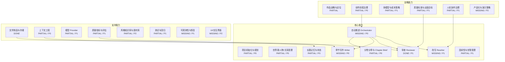
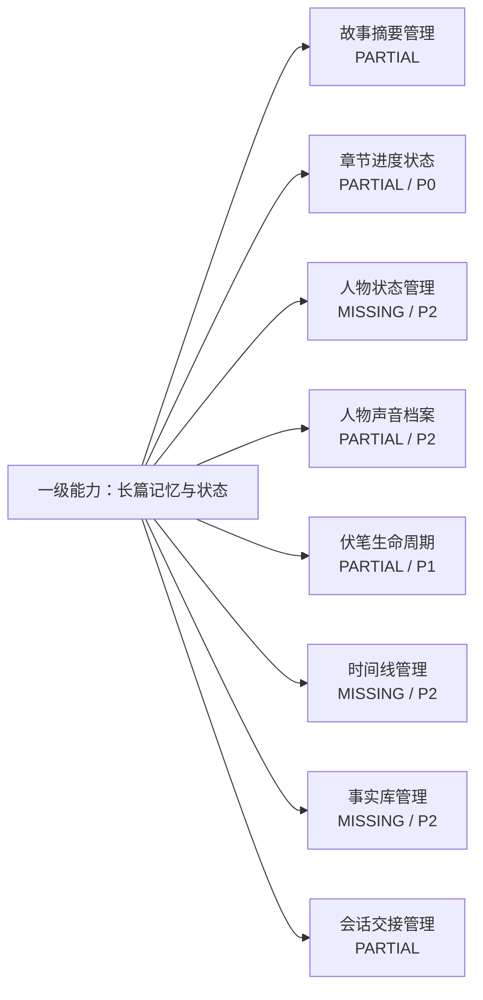

# Novel Agent 项目能力地图

> 参考业务能力图的表达方式，本图把 Novel Agent 拆成三层一级能力：战略能力、核心能力、支持能力。  
> 每个一级能力下继续拆二级能力，并用成熟度标记当前实现状态、目标差距和优先级。

## 1. 成熟度图例

| 标记 | 含义 | 判断标准 |
| --- | --- | --- |
| DONE | 已具备 | 有源码、命令或测试支撑，可以演示或运行 |
| PARTIAL | 部分具备 | 有数据结构、单点工具或设计雏形，但没有完整接入主链路 |
| MISSING | 缺失 | 仅文档提到或完全没有实现 |
| DESIGN | 设计存在 | 旧文档或架构图中有方案，但当前代码未落地 |

优先级：

| 优先级 | 含义 |
| --- | --- |
| P0 | 主链路必须补齐，否则不能称为自动化长篇写作 Agent |
| P1 | 质量闭环和可生产化能力 |
| P2 | 作品质感、规模化和体验增强 |

## 2. 一级能力总览



## 3. 战略能力

战略能力回答三个问题：系统要写什么样的书、用什么方式长期稳定写下去、如何让质量和成本可控。

| 一级能力 | 二级能力 | 成熟度 | 当前证据 | 目标差距 |
| --- | --- | --- | --- | --- |
| 作品战略与定位 | 小说类型定位 | PARTIAL | `skills/styles/ancient-romance.md` 聚焦古言言情 | 缺少项目级 genre/theme/reader contract 结构化字段 |
| 作品战略与定位 | 作品目标与篇幅规划 | PARTIAL | `_chapters.json` 有章节目标字数 | 缺少分卷、总字数、节奏曲线、高潮节点规划 |
| 作品战略与定位 | 风格目标 | PARTIAL | `QUALITY_RUBRIC.md`、风格指南 | 风格目标未进入所有 Agent 的统一系统契约 |
| 创作流程治理 | 阶段定义 | PARTIAL | `NovelState.currentPhase`、`ChapterProgress.status` | 状态字段存在，但没有状态机强约束 |
| 创作流程治理 | 自动推进策略 | MISSING / P0 | 仅 `main.ts` 手动命令 | 缺 `continue` Orchestrator |
| 创作流程治理 | 异常处理与恢复 | MISSING / P1 | `attempts/lastError` 字段存在 | 未接入 retry/recovery |
| 多模型与成本策略 | 角色模型路由 | DONE | `src/models.ts` 暴露 `write/plan/review/compress/extract/audit/opus` | `write/compress/opus` 尚未被主链路消费 |
| 多模型与成本策略 | 上下文预算 | PARTIAL | `context-profiler.ts` | 只观测，不阻断，不自动压缩 |
| 多模型与成本策略 | 升级策略 | MISSING / P1 | `opus` endpoint 存在 | 无低分升级、关键章升级策略 |
| 质量标准与出版目标 | 评分标尺 | DONE | `QUALITY_RUBRIC.md`、Reviewer 6 维评分 | 评分未落盘形成质量历史 |
| 质量标准与出版目标 | 质量门禁 | MISSING / P1 | 无 | 低分不会阻断下一步 |
| 人机协作治理 | 人工确认 | PARTIAL | 当前靠人工编辑文件和命令行查看 | 缺 brief confirm、accept confirm、low score pause |
| 产品化与演示策略 | 无 API 演示 | PARTIAL | `metrics/context/plan` 可演示 | 缺 `docs/DEMO.md` |
| 产品化与演示策略 | UI 展示 | MISSING / P2 | 无前端/TUI | 后续可做状态面板和章节看板 |

## 4. 核心能力

核心能力是 Novel Agent 真正面向“长篇小说生产”的业务能力。

### 4.1 核心能力总表

| 一级能力 | 二级能力 | 成熟度 | 当前证据 | 下一步 |
| --- | --- | --- | --- | --- |
| 项目初始化与规划 | 新建小说目录 | DESIGN | README 宣称 `npm start`，当前无脚本 | P0：先修文档；后续实现 init |
| 项目初始化与规划 | Premise 输入 | PARTIAL | 样例小说有 `_premise.md` | 建立标准 schema |
| 项目初始化与规划 | 大纲生成功能 | DESIGN | 旧文档提到 | 当前无自动 Planner |
| 项目初始化与规划 | 人物/关系生成 | DESIGN | 旧文档提到 | 当前仅消费已有文件 |
| 世界观/人物/关系管理 | 大纲文件 | DONE | `_outline.md` | 与状态同步 |
| 世界观/人物/关系管理 | 人物设定 | DONE | `_characters.md` | Writer Pack 强制注入相关人物 |
| 世界观/人物/关系管理 | 人物关系 | DONE | `_relationships.md` | 增加关系阶段状态 |
| 世界观/人物/关系管理 | 角色声音档案 | PARTIAL / P2 | `extractVoiceProfiles()` | CLI 未接入，未被 Writer 使用 |
| 分卷分章与 Chapter Brief | 章节元数据 | DONE | `_chapters.json`、`ChapterMeta` | 增加分卷/剧情弧字段 |
| 分卷分章与 Chapter Brief | 章节 Brief | PARTIAL / P0 | `chapter-brief.ts`、`_briefs/*.json` | 当前规则版，需要 Planner Agent 或人工确认门 |
| 分卷分章与 Chapter Brief | XML Chapter Plan | PARTIAL | `xml-plan.ts` | 未接入主流程 |
| 章节写作 Writer | 章节正文生成 | MISSING / P0 | 无 `writer.ts` | 新增 Writer Agent |
| 章节写作 Writer | 写作上下文包 | MISSING / P0 | 无 Writer Pack | 新增 `context-packs.ts` |
| 章节写作 Writer | 草稿落盘 | MISSING / P0 | 当前章节多为人工/历史产物 | 工程代码控制路径 |
| 审查 Reviewer | 单章质量审阅 | DONE | `reviewChapter()` | 保存 review artifact |
| 审查 Reviewer | 跨章连贯性审计 | DONE | `runCoherenceAudit()` | 审计结果落盘并进入 open questions |
| 审查 Reviewer | 计划覆盖验证 | PARTIAL | `verifyAgainstPlan()` | 未接入 CLI |
| 改写 Rewriter | weak spots 改写 | MISSING / P1 | 无 | 新增 Rewriter Agent |
| 改写 Rewriter | 多轮重写记录 | PARTIAL | `rewriteHistory` 字段 | 无实际调用 |
| 长篇记忆与状态 | 会话状态 | DONE | `NovelState` | 需 reconcile |
| 长篇记忆与状态 | 故事摘要 | PARTIAL | `_story_so_far.md`、`runAnalysisAgent()` | 更新频率和写作消费未稳定 |
| 长篇记忆与状态 | 伏笔记录 | PARTIAL | `_foreshadowing.json` | 缺生命周期更新器 |
| 长篇记忆与状态 | Timeline/Facts DB | MISSING / P2 | 无 | 后续结构化事实库 |
| 连续性与伏笔管理 | 时间线检查 | PARTIAL | Audit prompt 检查时间线 | 无结构化时间线 |
| 连续性与伏笔管理 | 伏笔埋设/推进/回收 | PARTIAL | `_foreshadowing.json`、XML plan type | 无自动更新和门禁 |
| 自动推进 Orchestrator | CLI Router | DONE | `main.ts` | 只是命令分发 |
| 自动推进 Orchestrator | Chapter State Machine | PARTIAL / P0 | 状态字段存在 | 缺合法转移模块 |
| 自动推进 Orchestrator | `continue` | MISSING / P0 | 无 | 第一阶段主任务 |

### 4.2 核心链路能力层级

```text
L1 核心能力：长篇小说生产主链路

  L2 项目初始化与规划
    L3 premise 管理
    L3 大纲管理
    L3 人物设定管理
    L3 人物关系管理
    L3 章节列表管理

  L2 分章策划
    L3 ChapterMeta
    L3 ChapterBrief
    L3 XML ChapterPlan
    L3 Brief 校验
    L3 人工确认门

  L2 章节写作
    L3 Writer Context Pack
    L3 Writer Agent
    L3 草稿落盘
    L3 字数/场景/伏笔约束
    L3 人物声音约束

  L2 质量审查
    L3 本地 Metrics
    L3 LLM Review
    L3 Plan Coverage Verify
    L3 Coherence Audit
    L3 Review Artifact

  L2 改写闭环
    L3 weak spots 定位
    L3 Rewriter Agent
    L3 rewrite attempts
    L3 低分暂停
    L3 人工接受门

  L2 长篇记忆
    L3 Story So Far
    L3 Foreshadowing Registry
    L3 Character State
    L3 Timeline
    L3 Facts DB
```

## 5. 支持能力

支持能力不直接“写小说”，但决定系统能否长期稳定、可维护、可扩展。

| 一级能力 | 二级能力 | 成熟度 | 当前证据 | 目标差距 |
| --- | --- | --- | --- | --- |
| 文件制品与存储 | Markdown 内容存储 | DONE | `novels/*/*.md` | 需规范命名和草稿/修订路径 |
| 文件制品与存储 | JSON 状态存储 | DONE | `_state.json`、`_chapters.json`、`_foreshadowing.json` | 需 schema 校验 |
| 文件制品与存储 | 人类可读状态 | DONE | `STATE.md` | 需与 JSON 状态一致 |
| 上下文工程 | Context Profiler | DONE | `context-profiler.ts` | 可演示 |
| 上下文工程 | Context Pack | MISSING / P0 | 无 | Writer/Review/Audit Pack |
| 上下文工程 | 自动压缩 | MISSING / P1 | 无 | 分层摘要、最近章节窗口 |
| 模型 Provider | Anthropic | DONE | `@anthropic-ai/sdk` | 可用 |
| 模型 Provider | OpenAI-compatible | DONE | `openai-compatible.ts` + tests | 可用 |
| 模型 Provider | DeepSeek Web | PARTIAL | `deepseek-web.ts` | PoW 简化，稳定性风险 |
| 质量指标与评估 | 本地文本指标 | DONE | `quality-metrics.ts` | 可作为 review 前置检查 |
| 质量指标与评估 | LLM 评分 | DONE | `reviewChapter()` | 缺落盘和门禁 |
| 质量指标与评估 | Golden Eval | MISSING / P1 | 无 | prompt/策略回归需要 |
| 风格知识库与素材库 | 风格指南 | DONE | `skills/styles/ancient-romance.md` | 可用 |
| 风格知识库与素材库 | 风格样例索引 | PARTIAL | `skills/_index.json` | 未被代码检索 |
| 风格知识库与素材库 | 原文素材 | DONE | `downloads/*.txt` | 未进入检索/引用系统 |
| 测试与回归 | 单元测试 | PARTIAL | `tests/**/*.test.ts` | 当前依赖缺失导致未跑通 |
| 测试与回归 | E2E 测试 | MISSING / P1 | 无 | 需要 mock LLM 流程 |
| 可观测性与恢复 | 模型配置输出 | DONE | `printModelConfig()` | 基础可观测 |
| 可观测性与恢复 | Artifact 审计轨迹 | MISSING / P1 | review/audit 只打印 | 需要 `_reviews/_audits` |
| UI/交互界面 | CLI | DONE | `main.ts` | 基础 |
| UI/交互界面 | TUI/Web UI | MISSING / P2 | 无 | 后续看板 |

## 6. 二级能力展开示例：长篇记忆与状态

以下是仿照图例右侧“二级业务能力”的展开方式，以“长篇记忆与状态”为例。



| 二级能力 | 应有内容 | 当前状态 | 验收方式 |
| --- | --- | --- | --- |
| 故事摘要管理 | 每章后更新 `_story_so_far.md`，供下一章写作使用 | `analyze` 可生成，但未自动触发 | Writer Pack 中必须包含摘要 |
| 章节进度状态 | 每章从 pending 到 accepted 可恢复推进 | 字段存在，缺状态机 | 单测覆盖状态转移 |
| 人物状态管理 | 位置、伤病、秘密、关系阶段、称呼 | 缺失 | `_character_state.json` 可查询 |
| 人物声音档案 | 角色语言风格、句式、禁忌 | 提取函数存在 | Writer/Reviewer 自动注入 |
| 伏笔生命周期 | plant/advance/resolve 状态更新 | JSON 存在，缺更新器 | 每章后可列出应推进伏笔 |
| 时间线管理 | 事件日期、先后顺序、持续时间 | 缺失 | Audit 可引用结构化时间线 |
| 事实库管理 | 不可违背事实、已揭露事实、隐藏事实 | 缺失 | Writer 遇冲突时阻断 |
| 会话交接管理 | session 记录、next steps、open questions | 字段存在 | `STATE.md` 可恢复上下文 |

## 7. 当前能力成熟度热力图

```text
DONE:
  CLI Router
  Text Metrics
  Context Profiler
  Reviewer
  Coherence Audit
  Researcher Analyze
  NovelState 文件状态
  Model Routing
  OpenAI-compatible Provider
  Style Guide
  File Artifacts

PARTIAL:
  Chapter Brief
  XML Chapter Plan
  Story So Far
  Foreshadowing Registry
  Voice Profiles
  Workflow State
  HITL
  Quality Rubric
  Tests
  DeepSeek Web Provider

MISSING:
  Writer Agent
  Rewriter Agent
  Planner Agent
  Continue Orchestrator
  State Machine
  Writer Context Pack
  Review/Audit/Rewrite Context Pack
  Review Artifacts
  Quality Gate
  Timeline/Facts DB
  Character State DB
  Golden Eval
  Retry/Recovery
  UI Dashboard
```

## 8. 与行动计划的关系

这份能力地图回答“Novel Agent 应该具备哪些能力，以及当前成熟度如何”。  
`docs/NOVEL_AGENT_ACTION_PLAN.md` 回答“下一步怎么做、先做哪些任务、验收标准是什么”。

建议后续维护方式：

- 能力地图只描述能力层级和成熟度，不写太多实现细节。
- 行动计划记录迭代路线、任务拆分和验收标准。
- 每完成一个 P0/P1 能力，更新本文件的成熟度和证据路径。

## 9. 建议优先补齐的能力链

第一条最小闭环应为：

```text
状态机
  -> continue Orchestrator
  -> Writer Context Pack
  -> Writer Agent
  -> Review Artifact
  -> Quality Gate
  -> Rewriter Agent
```

原因：这条链一旦打通，Novel Agent 才从“工具集”升级为“能自动推进长篇小说生产的 Agent 系统”。
