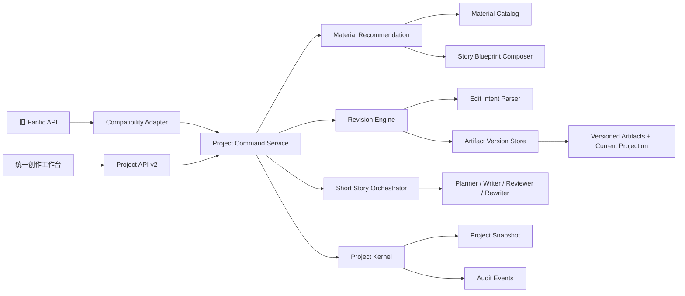
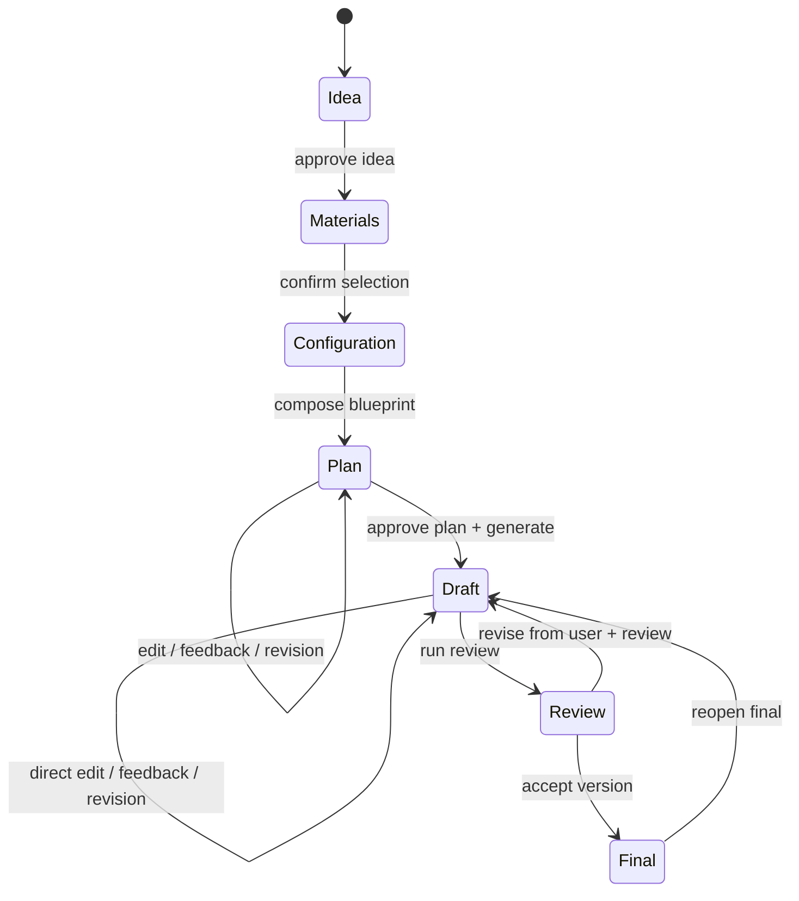

# P0 统一创作工作台技术设计

> 状态：Proposed
> 范围：统一项目外壳、素材推荐与选择、创作配置、版本化修改、短篇多轮迭代
> 不包含：长篇章节生成、跨项目自动偏好学习、账号/部署、向量数据库

## 1. 结论

P0 的目标不是同时完成长篇和短篇生成，而是：

1. 用统一项目模型承载 `short` 与 `long` 两种模式；
2. 让短篇完成“灵感 → 素材建议 → 用户选择/微调 → 创作配置 → 计划 → 正文 → 多轮修改 → 接受”的闭环；
3. 为长篇保留相同的项目、版本、事件和配置合同，但 P0 只提供现有长篇项目的只读导入/能力说明，不实现长篇 Writer；
4. 所有修改都形成可审计的新版本，不再覆盖唯一草稿；
5. P0 记录反馈和修改意图，但只把用户明确确认的内容提升为项目偏好，不自动推断全局偏好。

这套边界优先解决当前最影响用户价值的问题，同时避免把 P0 扩张成长篇记忆、向量检索、账户系统和完整事件溯源的集合。

## 2. 现状约束

当前短篇链路已经具备：

- `parse_idea → approve_idea → generate_plan → approve_plan → generate_draft → review → rewrite → final`；
- 固定 artifact 路径，例如 `_idea.json`、`_plan.json`、`_drafts/draft-001.md`；
- 本地 HTTP API 与 UI snapshot；
- 可注入的 Planner、Writer、Reviewer、Rewriter，便于测试。

当前不能破坏的合同：

- 现有 `fanfics/{storyId}` 项目必须能继续读取；
- 现有 `/api/fanfic/session`、`/api/fanfic/action`、`/api/fanfic/story-card` 在迁移期继续工作；
- 现有固定 artifact 路径继续作为“当前版本投影”；
- LLM 不能决定文件路径、状态转移和版本号；
- 现有无网络测试必须继续通过。

当前主要限制：

- 状态机是单向枚举，无法自然表达退回、重新打开、重复修改；
- story card 修改只增加全局 revision，没有修改事件和内容版本；
- plan、draft、final 缺少统一编辑合同；
- 素材库只支持按 `sourceId` 读取，没有跨来源搜索、排序和选择；
- `skills/preferences.md`、长篇 decisions、rewriteHistory 未进入短篇生成上下文。

## 3. P0 成功标准

### 3.1 用户流程

一个全新短篇项目必须能够：

1. 创建项目并选择短篇模式；
2. 输入自由灵感并生成结构化故事卡；
3. 从人物、关系、剧情模式、章节钩子和高光中各获得可解释的素材候选；
4. 选择、删除或改写候选素材；
5. 选择文风和人物塑造参考；
6. 生成并修改短篇计划；
7. 生成正文；
8. 通过直接编辑或自然语言要求至少连续修改三轮；
9. 查看每轮差异，回到任一旧版本并继续修改；
10. 关闭进程后重新进入项目，恢复到同一 head version 和待处理动作；
11. 接受终稿后仍可重新打开，并从已接受版本创建新版本。

### 3.2 工程标准

- 所有 mutating command 都有 `requestId`、`expectedRevision` 和确定的幂等语义；
- 磁盘写入使用临时文件 + 原子 rename；
- 版本内容写入成功前，不更新 project snapshot；
- schema 在 API 边界和文件读取边界均进行运行时校验；
- 老项目可以无损导入；迁移不移动或删除原文件；
- 旧 API 由兼容适配器投影到新 command service；
- 测试可使用 fake model，不依赖真实 API。

## 4. 范围边界

### 4.1 P0 包含

- 逻辑统一的项目模型；
- `short | long` 模式字段与能力声明；
- 现有长篇项目只读导入；
- 素材 catalog、规则召回、可选 LLM 重排；
- 素材选择、用户 override 和来源追踪；
- 风格/人物参考选择；
- 计划和正文的版本化直接编辑；
- 自然语言修改意图解析；
- 短篇多轮 revision loop；
- diff、恢复、reopen；
- 项目级显式偏好；
- v2 本地 API 与旧 API 兼容层。

### 4.2 P0 不包含

- 长篇章节 Writer/Rewriter/Story Bible；
- 自动从行为推断跨项目偏好；
- embedding、向量数据库或外部搜索服务；
- 多人协同编辑和实时 OT/CRDT；
- 任意版本分支合并；
- 登录、云同步、权限、部署；
- 自动导入受版权保护的完整原文进入生成上下文。

## 5. 总体架构



### 5.1 设计原则

1. **项目快照是当前事实源**：启动时不需要重放全部事件。
2. **事件是审计日志**：记录谁在何时为什么改变了什么，但不承担完整 event sourcing。
3. **工作流阶段与 artifact 生命周期分离**：避免状态组合爆炸。
4. **接受不是终止**：accepted version 不可变，但项目可以 reopen 并创建后续版本。
5. **回滚是向前创建版本**：不移动历史 head，不做破坏性恢复。
6. **素材只进入 planning context**：正文模型只消费经过选择、抽象和安全处理的 Story Blueprint。
7. **LLM 只产出候选内容**：工程层负责校验、版本、路径、状态和提交。

## 6. 模块划分

建议新增以下目录。P0 不要求立即移动现有模块，先通过 adapter 接入。

```text
src/
  projects/
    schemas.ts
    project-store.ts
    project-locator.ts
    project-lock.ts
    command-service.ts
    event-store.ts
    migration.ts
    compatibility.ts
  creation/
    material-catalog.ts
    material-ranker.ts
    material-selection.ts
    creation-config.ts
    story-blueprint.ts
    reference-catalog.ts
  revisions/
    schemas.ts
    intent-parser.ts
    revision-service.ts
    version-store.ts
    diff.ts
    validators.ts
  fanfic/
    conversation-orchestrator.ts
    command-handlers.ts
    context-builder-v2.ts
  api/
    project-http-server.ts
    errors.ts
```

### 6.1 Project Kernel

职责：

- 创建、加载、迁移项目；
- 校验 command；
- 处理 optimistic concurrency 和 request 幂等；
- 原子提交 snapshot、event 和 artifact version；
- 计算 capability 和 next actions；
- 向旧 fanfic 状态和固定路径输出兼容投影。

### 6.2 Material Recommendation

职责：

- 扫描 `materials/runs/*`、character cards 和 style references；
- 建立轻量 catalog；
- 根据 idea/canon 召回和排序候选；
- 保存推荐快照与用户选择；
- 把选择组合为只用于规划的 Story Blueprint。

### 6.3 Revision Engine

职责：

- 接受直接编辑或自然语言反馈；
- 解析 `EditIntent`；
- 生成 proposed version；
- 运行 artifact-specific validation；
- 生成 diff；
- approve、reject、reopen 和 rollback-as-new-version。

### 6.4 Short Story Orchestrator

职责：

- 根据 project snapshot 计算允许动作；
- 组装当前有效 artifact、素材选择、风格和偏好；
- 调用现有 Planner/Writer/Reviewer/Rewriter；
- 把模型输出作为 proposed version，而不是直接覆盖 current；
- 支持同一 plan/draft 上的多轮 feedback loop。

## 7. 核心数据模型

以下为合同草案；实现时使用集中式运行时 schema。推荐引入 Zod，避免继续在各模块散落手写断言。

### 7.1 Project Manifest

```ts
type StoryMode = "short" | "long";

interface StoryProjectManifest {
  schemaVersion: 2;
  projectId: string;       // 机器 ID，不承载展示语义
  slug: string;            // 旧 storyId 兼容字段
  title: string;           // 可使用中文
  mode: StoryMode;         // 创建后不可修改
  revision: number;
  workflow: {
    stage: "idea" | "materials" | "configuration" | "plan" | "draft" | "review" | "final";
    pausedReason?: "awaiting_user" | "command_failed" | "capability_unavailable";
  };
  capabilities: {
    canRecommendMaterials: boolean;
    canGeneratePlan: boolean;
    canGenerateDraft: boolean;
    canRevise: boolean;
    canGenerateLongForm: boolean;
  };
  heads: Partial<Record<ArtifactKind, string>>; // artifactVersionId
  approved: Partial<Record<ArtifactKind, string>>;
  acceptedFinalVersionId?: string;
  activeSelectionId?: string;
  activeConfigId?: string;
  explicitPreferenceProfileId?: string;
  lastEventSequence: number;
  recentCommandReceipts: CommandReceipt[]; // 最多保留最近 100 条
  createdAt: string;
  updatedAt: string;
}
```

`mode` 不能在创建后切换。短篇转长篇应是“从已有项目创建新项目并引用来源”，不能原地改变语义。

### 7.2 Artifact Version

```ts
type ArtifactKind =
  | "idea"
  | "canon"
  | "material_selection"
  | "creation_config"
  | "story_blueprint"
  | "plan"
  | "writer_context"
  | "draft"
  | "review"
  | "final";

interface ArtifactVersion {
  artifactVersionId: string;
  artifactKind: ArtifactKind;
  version: number;
  projectRevision: number;
  parentVersionId?: string;
  contentPath: string;
  contentType: "application/json" | "text/markdown";
  contentHash: string;
  origin: "model" | "user_edit" | "revision" | "rollback" | "migration";
  lifecycle: "proposed" | "approved" | "accepted" | "rejected" | "superseded";
  editIntentId?: string;
  createdBy: "user" | "system" | "model";
  createdAt: string;
}
```

P0 使用线性 parent chain，不实现 branch merge。恢复旧版本时复制其内容并创建新的 `origin=rollback` 版本。

### 7.3 Project Event

```ts
interface ProjectEvent<T = unknown> {
  eventId: string;
  sequence: number;
  projectId: string;
  projectRevision: number;
  type: ProjectEventType;
  actor: "user" | "system" | "model";
  requestId?: string;
  artifactVersionId?: string;
  payload: T;
  timestamp: string;
}
```

事件按 `_events/000001-{eventId}.json` 的形式保存，而不是把 JSONL 当作唯一事实源。这样可以使用原子 rename，并在崩溃恢复时逐个核对。同一 sequence 可能存在一次崩溃留下的 orphan event；只有 `sequence <= _project.json.lastEventSequence` 的事件属于已提交历史。

### 7.4 素材候选与选择

```ts
interface MaterialCandidate {
  candidateId: string;
  materialId: string;
  materialKind: MaterialKind | "character_reference" | "style_reference";
  sourceId: string;
  sourceHash: string;
  label: string;
  abstractPattern: string;
  tags: string[];
  reason: string;
  score: number;
  evidenceRef?: string;
  safetyNote: string;
}

interface MaterialSelectionItem {
  candidateId: string;
  selected: boolean;
  userOverride?: string;
  locked: boolean;
}

interface MaterialSelection {
  selectionId: string;
  ideaVersionId: string;
  recommendationSnapshotId: string;
  items: MaterialSelectionItem[];
  createdAt: string;
  updatedAt: string;
}
```

`sourceHash` 用来检测素材库更新后推荐结果是否已过期。用户选择保存推荐快照，不在每次打开页面时重新排名。

### 7.5 创作配置与 Blueprint

```ts
interface CreationConfig {
  configId: string;
  styleProfileRefs: string[];
  characterReferenceRefs: Array<{
    referenceId: string;
    borrow: string[];
    avoid: string[];
  }>;
  narrative: {
    viewpoint?: string;
    tense?: string;
    tone?: string;
    pacing?: string;
  };
  boundaries: string[];
  explicitProjectPreferences: string[];
}

interface StoryBlueprint {
  blueprintId: string;
  ideaVersionId: string;
  canonVersionId: string;
  selectionId: string;
  configId: string;
  characterPatterns: string[];
  relationshipDynamics: string[];
  plotPatterns: string[];
  highPoints: string[];
  hooks: string[];
  styleInstructions: string[];
  safetyNotes: string[];
  planningOnly: true;
}
```

参考人物的原名和原文 evidence 默认不进入 Writer Context；Writer 只接收抽象后的 `borrow/avoid/pattern`。

### 7.6 修改意图

```ts
type EditOperation =
  | "replace"
  | "expand"
  | "condense"
  | "delete"
  | "reorder"
  | "tone_shift"
  | "character_adjustment"
  | "plot_adjustment"
  | "style_polish";

interface EditIntent {
  editIntentId: string;
  sourceFeedbackEventId: string;
  targetArtifactKind: "idea" | "canon" | "plan" | "draft" | "final";
  targetVersionId: string;
  scope: {
    type: "field" | "scene" | "paragraph" | "full";
    locator?: string;
  };
  operations: EditOperation[];
  constraintsToPreserve: string[];
  requestedChanges: string[];
  preferenceScope: "this_edit" | "project";
  confidence: number;
  rawFeedback: string;
}
```

规则优先识别“这一段”“第 2 场”“以后都不要”等明确表达；不确定时使用 LLM 输出结构化候选。低置信度或互相冲突的意图必须先让用户确认。

## 8. 状态与命令设计

### 8.1 为什么不扩展现有 FanficStatus

如果把“当前阶段、是否确认、是否有反馈、是否正在改写、是否接受、是否 reopen”都编码为一个枚举，状态数量会随功能相乘。P0 改为：

- `workflow.stage` 表示用户所处创作阶段；
- artifact version 的 `lifecycle` 表示内容是否 proposed/approved/accepted；
- `heads` 表示当前看到的版本；
- `approved` 表示后续生成允许消费的版本；
- `nextActions` 由规则计算，不持久化。

### 8.2 Command Envelope

```ts
interface ProjectCommand<TPayload> {
  type: ProjectCommandType;
  requestId: string;
  expectedRevision: number;
  payload: TPayload;
}
```

P0 命令：

```text
create_project
parse_idea
edit_structured_artifact
approve_artifact
recommend_materials
update_material_selection
update_creation_config
compose_story_blueprint
generate_plan
submit_feedback
apply_direct_edit
generate_revision
run_review
accept_version
reject_version
rollback_artifact
reopen_final
```

旧 `approve_idea`、`approve_plan`、`approve_draft` 映射为 `approve_artifact`；旧 `generate_rewrite` 映射为携带 review/feedback 的 `generate_revision`。

### 8.3 短篇多轮流程



`accept_version` 不把项目变成不可变终态。被接受版本本身不可修改；`reopen_final` 以它为 parent 创建新的 draft head。

## 9. 素材推荐策略

### 9.1 P0 采用可解释的轻量排序

第一版不引入向量数据库。流程：

1. 从 idea/canon 提取关键词、关系类型、题材、情绪、雷点；
2. 按 material kind、质量标记和安全字段做硬过滤；
3. 用标签重合、文本信号、素材置信度、来源多样性进行规则排序；
4. 每类保留 top N；
5. 允许用 LLM 对 top candidates 重新排序并生成推荐理由；
6. LLM 不可引入 catalog 中不存在的 material ID；
7. 推荐结果保存快照，用户选择后不因素材库变化自动漂移。

建议初始分值：

```text
tag overlap             0.35
idea/canon text signal  0.25
material confidence     0.15
kind-specific fit       0.15
source diversity        0.10
```

权重必须配置化并通过 fixtures 调整，不写进 prompt。

### 9.2 安全边界

- 只推荐结构、功能和关系动力；
- `copyrightSafeNote` 缺失的素材降级或隐藏；
- evidence 用于解释推荐，不直接进入正文 prompt；
- 用户 override 必须与来源 material 分开保存；
- Blueprint 保留 source refs，便于追踪“为什么出现这个建议”。

## 10. 修改与版本提交

### 10.1 直接编辑

- JSON artifact 使用 allowlisted JSON Pointer patch；
- Markdown P0 接受完整新内容或明确段落 locator，不实现协同文本操作；
- 服务端读取 expected head，应用修改并运行校验；
- 创建 `origin=user_edit` proposed version；
- 用户可立即 approve，或先查看 diff。

### 10.2 自然语言修改

```text
raw feedback
  → persist FeedbackEvent
  → parse EditIntent
  → validate target/scope/constraints
  → build revision context
  → model generates candidate content
  → artifact validator
  → persist proposed version
  → diff preview
  → user approve/reject/continue feedback
```

修改模型必须接收：

- 当前 target version；
- 已确认的 idea/canon/blueprint；
- 本轮 EditIntent；
- 明确要求保留的内容；
- 当前项目显式偏好；
- 与目标 artifact 相关的 review；
- 不接收无界历史对话全文。

### 10.3 偏好处理

P0 记录每个 feedback 和 EditIntent，但只有以下情况写入项目偏好：

- 用户明确选择“本项目后续都这样”；
- 用户确认系统提取的 preference candidate；
- 用户直接编辑项目偏好配置。

不因为重复两三次修改就自动写入全局偏好。跨项目自动学习延后到 P1。

## 11. 存储布局

P0 逻辑统一，物理目录保持兼容：短篇仍位于 `fanfics/`，长篇仍位于 `novels/`，由 `ProjectLocator` 解析。避免在同一阶段新增 `projects/` 并搬迁全部历史内容。

新短篇建议布局：

```text
fanfics/{slug}/
  _project.json
  _state.json                         # 旧状态兼容投影
  _events/
    000001-{eventId}.json
    000002-{eventId}.json
  _versions/
    idea/v000001-{artifactVersionId}.json
    idea/v000001-{artifactVersionId}.meta.json
    canon/v000001-{artifactVersionId}.json
    plan/v000001-{artifactVersionId}.json
    draft/v000001-{artifactVersionId}.md
    draft/v000002-{artifactVersionId}.md
    review/v000001-{artifactVersionId}.json
    final/v000001-{artifactVersionId}.md
  _recommendations/{snapshotId}.json
  _feedback/{feedbackEventId}.json
  _intents/{editIntentId}.json

  _idea.json                          # 当前版本兼容投影
  _canon.json                         # 当前版本兼容投影
  _plan.json                          # 当前版本兼容投影
  _drafts/draft-001.md                # 当前初稿兼容投影
  _drafts/draft-002.md                # 当前改写稿兼容投影
  _reviews/review-001.json            # 当前 review 兼容投影
  final.md                            # accepted final 兼容投影
```

每个版本都有独立 metadata；`_project.json.heads/approved` 只引用已提交版本，因此它是唯一提交边界。可额外生成版本索引以加快列表读取，但索引只能是可重建缓存，不能成为第二事实源。

加载时执行以下 reconcile：

- snapshot 引用的版本内容或 metadata 缺失：判定为项目损坏并停止写入，不静默回退；
- version/event 的 `projectRevision` 高于 snapshot revision：视为未提交 orphan，忽略并移入 `_recovery/orphans/`；
- 兼容投影缺失或 hash 不符：从 canonical head 重建；
- event sequence 小于等于 `lastEventSequence` 但文件缺失：记录 audit gap，允许读取但阻止覆盖式迁移。

## 12. 原子提交与并发

### 12.1 提交顺序

单个 command 的写入顺序：

1. 获取项目级本地锁；
2. 校验 `expectedRevision`；
3. 查询 `recentCommandReceipts` 是否已有 receipt；
4. 生成新 artifact 内容并写到同目录临时文件；
5. fsync/close 后 rename 为最终 version path；
6. 写 event 临时文件并 rename；
7. 把新 head、event sequence 和 command receipt 一并写入 project snapshot 临时文件；
8. rename project snapshot；snapshot rename 是 commit point；
9. 更新兼容投影并释放锁。

兼容投影失败不回滚 canonical version；记录 `projection_failed` 并允许 reconcile 重试。

若进程在第 4–7 步退出，snapshot 仍指向旧版本，新内容和事件属于 orphan；重启时 reconcile 会隔离它们。`recentCommandReceipts` 保留最近 100 个请求，覆盖浏览器重试和慢请求的实际窗口，避免把无限增长的幂等记录塞进 manifest。

### 12.2 并发策略

P0 只支持单机单项目串行写入：

- 进程内 project mutex；
- API 使用 `expectedRevision` 防止多个浏览器标签页覆盖；
- 冲突返回 HTTP 409，携带最新 revision 和 snapshot URL；
- 长时间模型调用不持有写锁：先读取 base snapshot，模型返回后重新校验 revision，再提交；
- base revision 已变化时不自动覆盖，返回 `stale_generation`，允许用户基于旧输出另存为候选版本。

## 13. API v2

保留旧 API；新 UI 使用：

```text
POST /api/projects
GET  /api/projects/{projectId}/snapshot
POST /api/projects/{projectId}/commands
GET  /api/projects/{projectId}/artifacts/{kind}/versions
GET  /api/projects/{projectId}/artifacts/{kind}/versions/{versionId}
GET  /api/projects/{projectId}/diff?from={id}&to={id}
```

所有 mutation 走统一 command endpoint：

```json
{
  "type": "submit_feedback",
  "requestId": "req_...",
  "expectedRevision": 12,
  "payload": {
    "targetVersionId": "av_...",
    "feedback": "第二场减少解释，多用两个人避开视线的动作",
    "preferenceScope": "this_edit"
  }
}
```

标准错误：

```ts
interface ApiError {
  code:
    | "validation_failed"
    | "command_not_allowed"
    | "revision_conflict"
    | "stale_generation"
    | "artifact_not_found"
    | "capability_unavailable"
    | "model_failed"
    | "projection_failed";
  message: string;
  retryable: boolean;
  projectRevision?: number;
  details?: unknown;
}
```

## 14. 兼容与迁移

### 14.1 现有短篇项目

加载时若存在 `_state.json` 但不存在 `_project.json`：

1. 读取现有 state 和 artifact；
2. 校验每个 artifact；
3. 为现有文件创建 `origin=migration` 的 version metadata；
4. 内容可以先原地引用，首次修改时再复制进 `_versions`；
5. 生成 project snapshot、version index 和单个 `legacy_project_imported` 事件；
6. 不删除、不改名、不移动旧文件。

迁移必须幂等；相同内容 hash 不生成重复版本。

### 14.2 现有长篇项目

P0 只创建逻辑 manifest 或只读 snapshot：

- `mode=long`；
- 展示大纲、人物、章节进度、摘要和现有审阅能力；
- `canGenerateLongForm=false`；
- 不改变 `novels/*` 中的正文和状态；
- 不把长篇旧状态强行映射为短篇工作流阶段。

### 14.3 旧 API

兼容 adapter 负责：

- 把旧 command 转成 v2 command；
- 从 v2 snapshot 推导旧 `FanficStatus`；
- 把当前 approved/head version 投影到固定路径；
- 在旧状态无法表达 v2 情况时返回最接近的 pending 状态，并附带 compatibility warning；
- 新 UI 完全切到 v2 后再评估移除旧 API。

## 15. 实施顺序

### Phase 0：合同与测试护栏

- 确认 schema、command、error、artifact compatibility 合同；
- 新增当前短篇项目的 migration fixture；
- 新增三轮修改的目标 E2E fixture；
- 冻结旧 API 回归测试。

完成条件：新实现尚未接入，但目标合同有测试表达。

### Phase 1：Project Kernel 与版本存储

- manifest、runtime schema、project locator；
- version store、per-version metadata、event store、atomic write；
- optimistic concurrency、request receipts；
- 老项目导入和兼容投影。

完成条件：能导入当前 fanfic，并对 plan/draft 创建、查看、恢复版本。

### Phase 2：素材推荐与创作配置

- catalog 扫描；
- deterministic ranker；
- recommendation snapshot；
- material selection、reference selection；
- Story Blueprint Composer。

完成条件：输入 idea 后可获得可解释候选，选择结果稳定写入项目，并被 plan context 消费。

### Phase 3：Revision Engine

- direct edit；
- feedback 和 intent parser；
- revision context；
- model revision；
- diff、approve/reject、rollback-as-new-version；
- 项目级显式偏好。

完成条件：计划和正文都能完成三轮修改、回滚和恢复。

### Phase 4：短篇 Orchestrator 与 UI v2

- computed next actions；
- v2 API；
- 模式入口、素材选择、创作配置、版本列表、diff UI；
- reopen final；
- 旧 API 兼容回归。

完成条件：完整用户流程无需手动改文件。

### Phase 5：稳定性与评估

- crash injection；
- stale generation；
- schema migration；
- recommendation fixtures；
- prompt 内容泄漏检查；
- 操作指标和失败诊断。

## 16. 测试策略

### 16.1 单元测试

- project schema 和 migration；
- allowed command / computed next actions；
- material ranker 的确定性和多样性；
- JSON patch allowlist；
- intent parser normalization；
- artifact validators；
- text/JSON diff；
- compatibility status projection。

### 16.2 集成测试

- 新项目完整流程；
- 旧项目导入后继续修改；
- 三轮 feedback 产生三条 parent chain；
- rollback 产生向前新版本；
- final reopen；
- 重复 requestId 不重复创建版本；
- expectedRevision 冲突返回 409；
- 模型调用期间 revision 变化返回 stale_generation；
- 投影失败后 reconcile。

### 16.3 质量回归

- 推荐候选必须来自 catalog；
- 未选素材不得进入 Blueprint；
- reference 原文/evidence 不得进入 Writer Context；
- 修改必须保留 `constraintsToPreserve`；
- 用户要求局部修改时，非目标区域变化率设告警阈值；
- 项目偏好只有经确认后才进入后续 context。

## 17. 可观测指标

P0 记录但不上传：

- `time_to_first_plan`、`time_to_first_draft`；
- 推荐候选选择率、override 率；
- 每个 artifact 的 revision 次数；
- revision approve/reject/rollback 率；
- 用户反馈到 proposed version 的耗时；
- stale generation、revision conflict、projection failure 数量；
- model call 失败率与重试次数；
- reopen final 次数。

指标不得记录正文、原始反馈或素材原文，只记录 ID、类型、时长和计数。

## 18. Grill Me 压力测试与结论

### 决策 1：P0 是否必须让长篇也能生成？

**挑战**：如果 UI 出现长短篇选择，但长篇不能生成，是否是在制造半成品？

**建议**：P0 的统一模型必须支持 `long`，但功能入口必须受 capability 控制。现有长篇只读导入可以展示其已有 plan/review/analyze/audit 能力；不得把 `canGenerateLongForm=false` 的入口伪装成可用。若产品要求两个按钮都能完整生成，项目应重新估算为 P0+P1，而不是挤进当前 P0。

**结论**：合理，但 UI 必须明确能力，不做假按钮。

### 决策 2：是否把现有状态机继续加状态？

**挑战**：新增 reject/reopen/feedback 状态看似最快。

**建议**：不扩展单一枚举。阶段与 artifact lifecycle 分离，next actions 计算得到。

**结论**：这是必要重构，否则很快出现不可测试的状态组合。

### 决策 3：是否采用完整事件溯源？

**挑战**：既然要记住每次行为，是否应让事件成为唯一事实源？

**建议**：否。P0 使用 snapshot + audit events。完整事件溯源会引入 replay、event upcaster、投影一致性和运维复杂度，当前收益不足。

**结论**：快照为事实源更适合本地单用户产品。

### 决策 4：是否一开始支持版本分支和合并？

**挑战**：小说修改可能有多个方向。

**建议**：P0 只支持线性版本链；恢复旧版通过创建新 head。方向分支和合并放到观察到真实需求以后。

**结论**：控制复杂度合理，且不丢历史。

### 决策 5：素材检索是否需要 embedding？

**挑战**：不用语义向量，推荐质量是否太差？

**建议**：先用结构化标签、文本信号、质量分和可选 LLM 重排。当前素材源数量太少，embedding 基础设施不会成为主要质量杠杆。

**结论**：P0 不上向量库是正确取舍；必须保存推荐数据以便未来验证是否需要升级。

### 决策 6：是否应该立即自动学习用户偏好？

**挑战**：理想态要求记住用户行为，P0 只记录是否不够？

**建议**：记录全部反馈与意图，只有明确确认后提升为项目偏好。未经确认的跨项目推断容易把单次剧情要求误学为永久风格。

**结论**：P0 的“显式偏好 + 完整证据”比早期自动学习更可靠。

### 决策 7：是否应该把短篇和长篇文件全部搬到 `projects/`？

**挑战**：逻辑统一但物理目录不统一，会不会留下技术债？

**建议**：P0 使用 ProjectLocator 统一访问，不搬动历史数据。物理迁移价值低、回归面大，而且不是用户价值。

**结论**：先逻辑统一、后物理统一是可逆且低风险的路线。

### 决策 8：长时间生成时如何避免覆盖用户刚完成的编辑？

**挑战**：模型调用开始后用户修改了项目，旧输出可能覆盖新 head。

**建议**：模型调用不持锁；提交时重新校验 base revision。发生变化时把输出保存为 stale candidate 或丢弃，由用户决定是否查看，绝不自动设为 head。

**结论**：必须实现，否则多标签页和慢模型会造成隐性数据丢失。

### 决策 9：旧路径双写是否会产生两个事实源？

**挑战**：canonical versions 和旧固定路径可能不一致。

**建议**：明确 `_project.json` 是 commit boundary，`_versions` 保存不可变内容与 metadata，旧路径和任何 version index 都只是可重建投影。投影失败可重建，读取 v2 时绝不反向信任投影。

**结论**：双写可接受，但必须单向且有 reconcile。

### 决策 10：自然语言修改是否会引起全文漂移？

**挑战**：模型收到局部修改要求，却重写整篇并改变未要求内容。

**建议**：EditIntent 必须包含 scope 和 preserve constraints；修改后计算非目标区域 diff，超过阈值则警告或拒绝。P0 不追求自动文本 patch 的完美，但要可见、可拒绝、可回滚。

**结论**：版本和差异检查能把模型不确定性变成可控候选，而不是直接破坏正文。

## 19. 风险清单

| 风险 | 影响 | 缓解 |
| --- | --- | --- |
| P0 被长篇需求重新膨胀 | 延期、架构反复 | capability 边界；长篇生成明确进入 P1 |
| 新旧状态双轨漂移 | UI 展示错误 | canonical/投影单向关系 + reconcile 测试 |
| 模型局部修改导致全文漂移 | 用户失去信任 | scope、preserve、diff 阈值、approve gate |
| 素材推荐泄漏原文或专有设定 | 内容与版权风险 | abstractPattern、evidence 隔离、context allowlist |
| 自动偏好误学 | 后续输出持续偏移 | P0 仅显式项目偏好 |
| 慢模型提交陈旧结果 | 覆盖用户编辑 | base revision + stale candidate |
| schema 快速变化 | 旧项目打不开 | schemaVersion、migration fixtures、读取边界校验 |
| 事件和 snapshot 不一致 | 恢复困难 | 原子文件、sequence、reconcile、crash tests |

## 20. 最终建议

该 P0 规划总体合理，但必须坚持四个约束：

1. P0 交付的是短篇多轮闭环，不是长篇生成；
2. 不把全部状态塞回现有 `FanficStatus`；
3. 不上完整事件溯源、版本分支合并和向量数据库；
4. 版本、反馈事件和 expected revision 必须从第一阶段就进入核心合同，不能后补。

如果这四项被接受，方案可以按 Phase 0 → 5 顺序进入实施。如果任意一项被否决，应先重新评估范围和工期，再开始编码。
